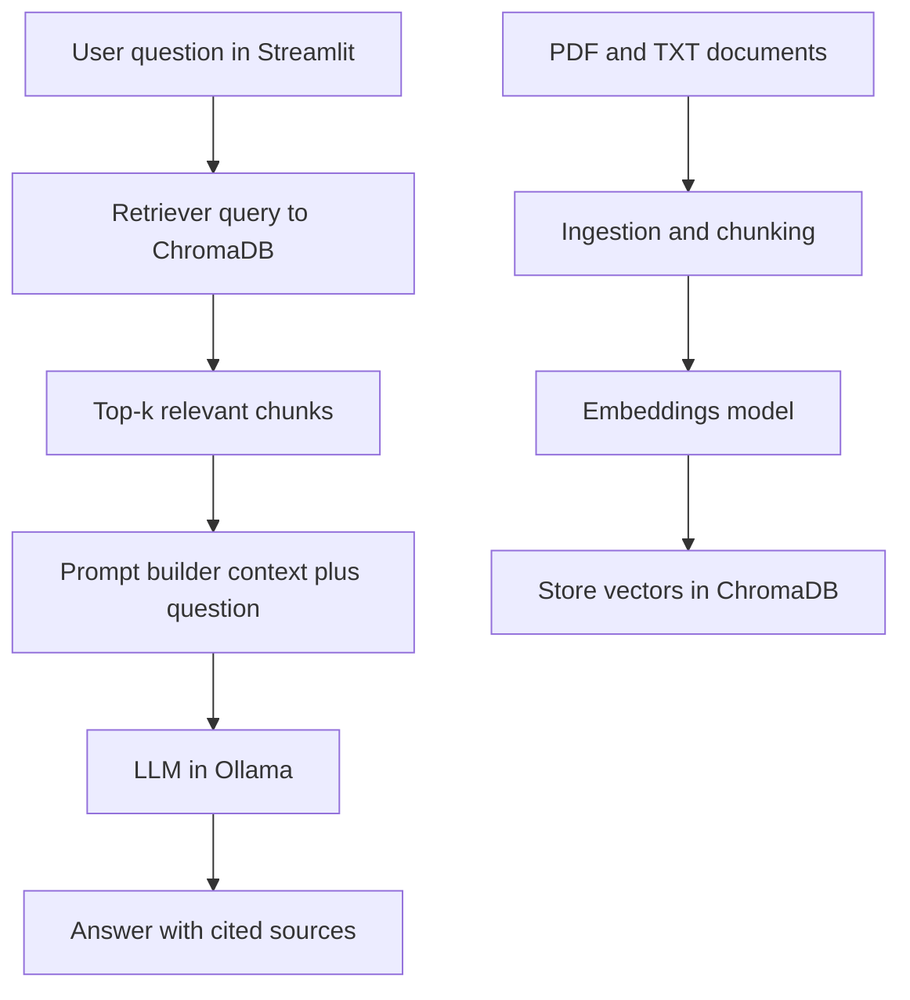

# Local-AI-Knowledge-Assistant

Local RAG chatbot for private documents, designed as a portfolio-ready AI integration project.
The app runs on-premises and combines:
- Streamlit UI
- Ollama-hosted LLM (for example `llama3`)
- ChromaDB vector storage
- Document indexing pipeline for PDF/TXT files

No user documents are sent to external cloud APIs.

## Why this project matters

This project demonstrates practical AI integration skills:
- building an end-to-end RAG pipeline
- connecting LLM + embeddings + vector DB + UI
- measuring answer quality and system performance
- packaging everything with Docker for reproducible deployment

## Key features

- Privacy-first: all data and inference stay local.
- RAG pipeline: automatic indexing of PDF/TXT documents.
- Source-grounded answers: assistant uses retrieved chunks as context.
- Streamlit chat UI: simple and clean chatbot interface.
- Docker-ready setup: easy local run and VPS deployment.

## RAG architecture (simple flow)



## Portfolio evidence checklist

Use this section to make the project "sell" in recruitment:

### 1) Metrics

Track and publish:
- response time (average and p95)
- number of indexed documents and chunks
- retrieval and generation latency
- answer quality on a fixed test set (10-20 questions)

Ready-to-fill metrics table:

| Metric | Target | Current | How measured |
|---|---:|---:|---|
| Avg response time (end-to-end) | <= 6.0s | TBD | mean of all benchmark questions |
| P95 response time (end-to-end) | <= 10.0s | TBD | 95th percentile from benchmark run |
| Avg retrieval latency | <= 1.5s | TBD | timer around vector search step |
| Avg generation latency | <= 4.0s | TBD | timer around LLM response step |
| Indexed documents | >= 10 | TBD | count of files successfully ingested |
| Indexed chunks | >= 200 | TBD | count from vector DB collection |
| Test set accuracy | >= 80% | TBD | correct answers / all benchmark questions |
| Citation coverage | >= 95% | TBD | answers that include at least 1 source |
| Hallucination rate | <= 10% | TBD | answers marked unsupported by sources |

### Benchmark script plan

Create a script at `scripts/benchmark.py` that:

1. loads a fixed evaluation dataset from `tests/benchmark_questions.json`
2. sends each question through the same RAG pipeline used by Streamlit
3. records timings:
   - total response time
   - retrieval latency
   - generation latency
4. checks output quality:
   - whether expected keywords/facts are present
   - whether at least one source is cited
5. saves results to `artifacts/benchmark/latest.json`
6. prints a markdown-ready summary table for README updates

Suggested CLI usage:

```bash
python scripts/benchmark.py --questions tests/benchmark_questions.json --out artifacts/benchmark/latest.json
```

Suggested output JSON shape:

```json
{
  "run_date": "2026-05-05",
  "model": "llama3",
  "documents_indexed": 12,
  "chunks_indexed": 286,
  "metrics": {
    "avg_response_time_s": 5.4,
    "p95_response_time_s": 9.2,
    "avg_retrieval_latency_s": 1.1,
    "avg_generation_latency_s": 3.9,
    "test_set_accuracy": 0.85,
    "citation_coverage": 0.97,
    "hallucination_rate": 0.08
  }
}
```

### 2) Architecture

- Keep the diagram above updated with final components.
- Add one short "design decisions" paragraph (why this embedding model, why local LLM, why ChromaDB).

### 3) Evidence (screens + GIF + examples)

Prepare:
- 2-3 screenshots of the UI
- 1 short GIF showing: add docs -> refresh index -> ask question -> get sourced answer
- 3 concrete Q and A examples with source chunks

### Q&A examples template (copy and fill)

Use this format for each showcased question:

#### Example 1 - [topic]

**User question**  
`[paste the exact question]`

**Assistant answer (short)**  
`[paste concise answer returned by the system]`

**Sources used**  
- `[document_name.pdf]` - section/chunk: `[chunk_id_or_heading]`
- `[document_name.txt]` - section/chunk: `[chunk_id_or_heading]`

**Why this is a good example**  
- `[for example: multi-hop retrieval across two documents]`
- `[for example: answer grounded in specific source passages]`

---

#### Example 2 - [topic]

**User question**  
`[paste the exact question]`

**Assistant answer (short)**  
`[paste concise answer returned by the system]`

**Sources used**  
- `[document_name.pdf]` - section/chunk: `[chunk_id_or_heading]`
- `[document_name.txt]` - section/chunk: `[chunk_id_or_heading]`

**Why this is a good example**  
- `[for example: correct rejection when context is missing]`
- `[for example: transparent citation of used chunks]`

---

#### Example 3 - [topic]

**User question**  
`[paste the exact question]`

**Assistant answer (short)**  
`[paste concise answer returned by the system]`

**Sources used**  
- `[document_name.pdf]` - section/chunk: `[chunk_id_or_heading]`
- `[document_name.txt]` - section/chunk: `[chunk_id_or_heading]`

**Why this is a good example**  
- `[for example: long-context retrieval still stays factual]`
- `[for example: clear, recruiter-friendly output quality]`

### 4) Lessons learned

Document real engineering trade-offs:
- chunking strategy (size and overlap) versus quality
- hallucination control via prompt constraints and retrieval quality
- limitations of local models (latency, context window, factual stability)

## Suggested project structure

```text
.
├── app/                 # Streamlit app
├── rag/                 # ingestion, embeddings, retrieval, generation
├── data/                # local documents
├── scripts/             # helper scripts, benchmarking
├── tests/               # unit/integration tests
├── docker-compose.yml
├── Dockerfile
└── README.md
```

## Run target (MVP)

Target MVP behavior:
- user asks a question in Streamlit chat
- system retrieves top-k relevant chunks from ChromaDB
- LLM answers based on context
- answer includes document sources

### Day 1 MVP definition (project gate)

Day 1 is complete only when all conditions below are true:
- chat flow is defined end-to-end (question -> retrieval -> sourced answer)
- answers are explicitly grounded in indexed documents
- each answer includes at least one source reference (document/chunk)
- base repository structure exists: `app/`, `rag/`, `data/`, `scripts/`, `tests/`
- `.gitignore` covers local artifacts (`venv`, `*.db`, cache, logs, temp outputs)

## Day 2 Docker-first baseline

Primary runtime for Day 2 is Docker Compose.

### Quick start

1. Create local env file:

```bash
cp .env.example .env
```

2. Build and run:

```bash
docker compose up --build -d
```

3. Verify service health:

```bash
docker compose ps
curl -f http://localhost:8501/_stcore/health
```

4. Open app:

```text
http://localhost:8501
```

### Fallback diagnostics (local venv)

Use this only when Docker-specific issues block progress (ports, mounts, permissions, daemon state):

```bash
python3 -m venv .venv
source .venv/bin/activate
pip install -r requirements.txt
streamlit run app/main.py
```

### Day 2 IT debate notes

Decisions, risks and ownership are documented in `docs/day2-it-debate.md`.
