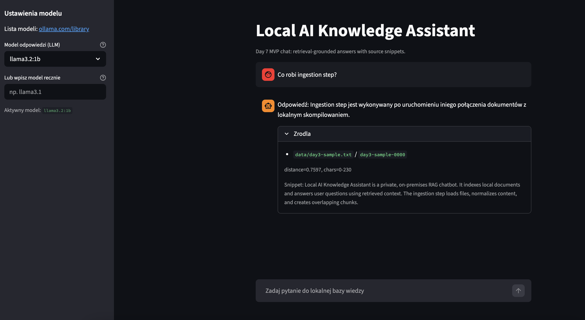
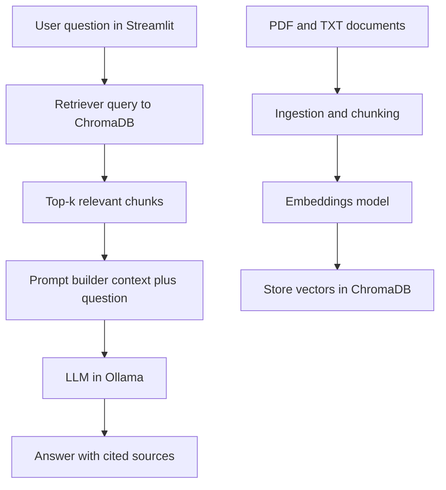

# Local AI Knowledge Assistant

Portfolio-ready, local-first RAG assistant for private documents (`.pdf`, `.txt`), built end-to-end with Python, Streamlit, Ollama and ChromaDB.

Projekt pokazuje praktyczną integrację AI: od ingestii dokumentów, przez embeddingi i retrieval, po chat UI z odpowiedziami opartymi o źródła.



## Project status

**Current delivery level:** completed MVP (Days 1-7 from `docs/todo.md`) and fully runnable in Docker.

What is already working:
- end-to-end RAG flow: question -> retrieval -> grounded answer with sources
- ingestion pipeline for `.pdf` and `.txt`
- embeddings + vector index in ChromaDB with metadata (`chunk_id`, `source_file`, `char_start`, `char_end`)
- Ollama-based generation with "do not guess" fallback behavior
- Streamlit chat UI with session history, loading state and source details

What is intentionally still planned (not claimed as done yet):
- in-app "refresh knowledge base" trigger
- benchmark metrics and evaluation dataset
- recruitment evidence package (GIF and curated Q&A examples)

## Why this project is good for recruitment

- **Real AI integration, not a toy demo:** complete Retrieval-Augmented Generation pipeline in production-like shape.
- **Privacy by design:** documents and inference stay local (no external LLM API required).
- **Deployment discipline:** primary runtime is Docker Compose, which makes setup reproducible on any machine.
- **Engineering clarity:** explicit data contracts, CLI tooling, env-based configuration and separated modules (`app`, `rag`, `scripts`).

## Tech stack and decisions

| Area | Technology | Why this choice |
|---|---|---|
| UI | Streamlit | Fast iteration and clear recruiter demo for chat workflows |
| LLM runtime | Ollama | Fully local model serving and predictable local deployments |
| Embeddings | `nomic-embed-text` | Solid default for semantic retrieval in local RAG setups |
| Vector store | ChromaDB | Lightweight, easy metadata handling, good fit for local prototyping |
| Backend language | Python 3.11 | Mature AI ecosystem and rapid implementation |
| Containerization | Docker + Docker Compose | One-command startup and environment parity |

## Docker-first architecture (fully containerized runtime)

This project is designed to run **primarily in Docker**:
- `app` container: Streamlit UI and RAG scripts
- `ollama` container: local LLM/embedding model server
- `ollama-init` one-shot container: pulls required models on first start
- shared project volume: consistent access to `data/`, `artifacts/`, and code

Local virtualenv is treated only as diagnostics fallback, not default workflow.

## RAG flow



## Quick start (recommended)

1. Prepare environment file:

```bash
cp .env.example .env
```

2. Build and start everything:

```bash
docker compose up --build -d
```

3. Verify health:

```bash
docker compose ps
curl -f http://localhost:8501/_stcore/health
```

4. Open app:

```text
http://localhost:8501
```

## Operational commands (Docker)

### Ingestion

```bash
docker compose run --rm app python scripts/ingest.py \
  --data-dir data \
  --chunk-size 900 \
  --chunk-overlap 150 \
  --report-path artifacts/ingest/latest.json
```

### Index embeddings

```bash
docker compose run --rm app python scripts/index_embeddings.py \
  --ingest-report artifacts/ingest/latest.json \
  --collection-name rag_chunks \
  --persist-dir artifacts/chroma \
  --embedding-model nomic-embed-text \
  --report-path artifacts/index/latest.json
```

### Retrieval test

```bash
docker compose run --rm app python scripts/retrieve.py \
  --question "What does the policy say?" \
  --top-k 4 \
  --persist-dir artifacts/chroma \
  --collection-name rag_chunks \
  --embedding-model nomic-embed-text
```

### Ask through full RAG + LLM

```bash
docker compose run --rm app python scripts/ask.py \
  --question "What are Day 6 goals?" \
  --top-k 4 \
  --persist-dir artifacts/chroma \
  --collection-name rag_chunks \
  --embedding-model nomic-embed-text \
  --llm-model llama3.2:1b
```

## Repository structure

```text
.
├── app/                 # Streamlit app
├── rag/                 # ingestion, embeddings, retrieval, generation logic
├── data/                # local documents for indexing
├── scripts/             # CLI workflows (ingest/index/retrieve/ask)
├── tests/               # tests and evaluation assets
├── docs/                # planning notes and portfolio materials
├── docker-compose.yml
├── Dockerfile
└── README.md
```

## Roadmap (aligned with `docs/todo.md`)

Next milestones:
- Day 8: refresh knowledge base from UI without app restart
- Day 9-10: benchmark metrics + fixed evaluation set
- Day 11: architecture/design decisions + limitations section
- Day 12: recruiter evidence package (GIF + 3 curated Q&A examples)
- Day 13-14: lessons learned + final polish for publication

## Notes for reviewers

- Main objective is to demonstrate practical AI product engineering, not only model prompting.
- The current baseline is stable for demos and local testing.
- Planned items are documented transparently and intentionally separated from completed scope.
